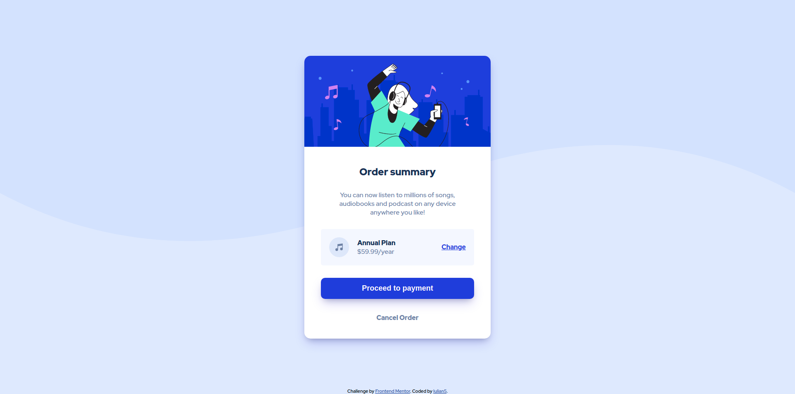

# Frontend Mentor - Order summary card solution

This is a solution to the [Order summary card challenge on Frontend Mentor](https://www.frontendmentor.io/challenges/order-summary-component-QlPmajDUj). Frontend Mentor challenges help you improve your coding skills by building realistic projects.

## Table of contents

- [Overview](#overview)
  - [The challenge](#the-challenge)
  - [Screenshot](#screenshot)
- [My process](#my-process)
  - [Built with](#built-with)
  - [What I learned](#what-i-learned)
- [Author](#author)

## Overview

### The challenge

Users should be able to:

- See hover states for interactive elements

### Screenshot

## My process

I just use the different design of the project and match as possible every details. Hope you will love this

### Built with

- Semantic HTML5 markup
- CSS custom properties
- Flexbox

### What I learned

I learned some CSS properties that can match together for example:
Background property can have multiple values.

## Author

- Website - Hope i make my own website with great design
- Frontend Mentor - [@Iulian5(https://www.frontendmentor.io/profile/iulian5)
